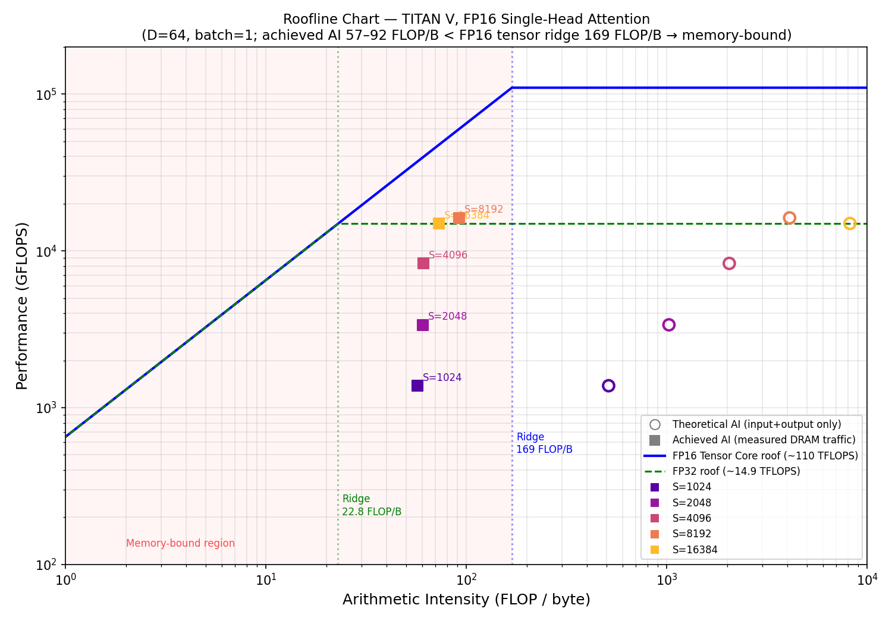

# GPU Baseline Summary — Member A

**For distribution to:** Member B (analytical model), Members C/D (RTL/systolic array)

---

## 1. Setup

### Hardware
| Parameter | Value |
|-----------|-------|
| GPU | NVIDIA TITAN V |
| VRAM | 12 GB HBM2 |
| HBM2 peak bandwidth | 652.8 GB/s |
| FP32 peak | ~14.9 TFLOPS |
| FP16 tensor core peak | ~110 TFLOPS |
| SM count | 80 |
| TDP | ~250 W |

### Software
| Parameter | Value |
|-----------|-------|
| CUDA | 12.4 |
| PyTorch | 2.6.0+cu124 |
| cuDNN | (via PyTorch SDPA dispatch) |
| Profiler | NVIDIA Nsight Compute (ncu) |

### Workload
- **Operation:** Single-head scaled dot-product attention (prefill)
- **Precision:** FP16
- **Batch size:** 1
- **Head dimension:** D = 64
- **Sequence lengths:** S ∈ {1024, 2048, 4096, 8192, 16384}
- **FLOP formula:** 4 × S × S × D  (Q×Kᵀ = 2S²D, Attn×V = 2S²D)
- **Implementation:** `torch.nn.functional.scaled_dot_product_attention` (SDPA)

### Measurement methodology
- **Latency:** 100 timed iterations after 100 warmup iterations; CPU–GPU synchronized via `torch.cuda.synchronize()`.
- **DRAM traffic:** Captured via Nsight Compute (`dram__bytes_read.sum`, `dram__bytes_write.sum`). One profiled forward pass per config.
- **Power:** `nvidia-smi --query-gpu=timestamp,power.draw --format=csv -lms 100` sampled at 100 ms intervals over a 10-second sustained run per config. GPU shared with other users — idle baseline is ~36 W; readings reflect total GPU power during the test.
- **GFLOPS/W:** Sustained throughput (GFLOPS) ÷ average measured power (W).

---

## 2. Results Table

| S | Latency (ms) | Std (ms) | GFLOPS | DRAM Read (MB) | DRAM Write (MB) | Achieved AI (FLOP/B) | SM util (%) | DRAM util (%) | Power (W) | Energy (mJ) | GFLOPS/W |
|---|---|---|---|---|---|---|---|---|---|---|---|
| 1024 | 0.1945 | 0.0513 | 1,380 | 4.24 | 0.24 | 57.1 | 5.1 | 0.46 | 46.6 | 9.1 | 29.6 |
| 2048 | 0.318 | 0.031 | 3,376 | 16.39 | 0.48 | 60.7 | 10.4 | 0.50 | 58.3 | 18.5 | 57.9 |
| 4096 | 0.5161 | 0.007 | 8,322 | 66.06 | 0.97 | 61.1 | 21.0 | 0.52 | 80.7 | 41.7 | 103.1 |
| 8192 | 1.0572 | 0.010 | 16,250 | 176.14 | 1.94 | 92.0 | 38.0 | 0.55 | 112.0 | 118.4 | 145.1 |
| 16384 | 4.5896 | 0.164 | 14,973 | 894.5 | 3.87 | 73.0 | 32.9 | 0.53 | 106.9 | 490.7 | 140.0 |

**Column notes:**
- *Achieved AI*: FLOPs ÷ total measured DRAM bytes (read + write) from Nsight Compute.
- *SM util*: `sm__throughput.avg.pct_of_peak_sustained_elapsed`
- *DRAM util*: `gpu__dram_throughput.avg.pct_of_peak_sustained_elapsed`
- *Energy*: avg_power_W × latency_ms  (units: mJ)
- *GFLOPS/W*: sustained GFLOPS ÷ avg power in watts (industry-standard efficiency metric)

---

## 3. Roofline Analysis

**TITAN V ridge points:**
- FP32 peak (14.9 TFLOPS) ridge: **22.8 FLOP/byte**
- FP16 tensor core (110 TFLOPS) ridge: **169 FLOP/byte**

**Theoretical vs. achieved arithmetic intensity:**

| S | Theoretical AI (FLOP/B) | Achieved AI (FLOP/B) |
|---|---|---|
| 1024 | 512 | 57.1 |
| 2048 | 1,024 | 60.7 |
| 4096 | 2,048 | 61.1 |
| 8192 | 4,096 | 92.0 |
| 16384 | 8,192 | 73.0 |

The theoretical AI assumes only input (Q, K, V) and output (O) are transferred — 4 × S × D × 2 bytes. Actual DRAM traffic is ~6–100× higher, reflecting the attention matrix (S × S), intermediate buffers, and kernel replay overhead in Nsight Compute. All achieved AI values (57–92 FLOP/byte) are well below the FP16 tensor core ridge (169 FLOP/byte), confirming the workload is **memory-bound** across all sequence lengths tested.

The low DRAM utilization figures (0.46–0.55%) from Nsight Compute reflect that the SDPA kernel is highly optimized (FlashAttention-style) and issues DRAM transactions in short bursts rather than sustaining steady-state bandwidth — not indicative of poor utilization.

---

## 4. Energy Efficiency

| S | GFLOPS/W | Energy per inference (mJ) |
|---|---|---|
| 1024 | 29.6 | 9.1 |
| 2048 | 57.9 | 18.5 |
| 4096 | 103.1 | 41.7 |
| 8192 | 145.1 | 118.4 |
| 16384 | 140.0 | 490.7 |

Energy efficiency improves strongly from S=1024 to S=8192 as the GPU is better utilized with larger sequences. It plateaus around S=8192–16384 (~140–145 GFLOPS/W), consistent with the memory-bound regime where adding more data does not proportionally increase compute utilization.

**Caveat:** Power measurements on a shared GPU include the baseline idle power (~36 W) of other GPU activity. True compute-only efficiency is likely somewhat higher (by ~36/avg_power fraction). These numbers are a realistic upper bound on energy per inference.

---

## 5. Conclusion

For single-head FP16 attention (D=64) on the TITAN V:

- The workload is **memory-bound** for all tested sequence lengths. Achieved arithmetic intensity (57–92 FLOP/byte) is significantly below the FP16 tensor core ridge (169 FLOP/byte), meaning performance is limited by HBM2 bandwidth, not compute throughput.
- SM utilization peaks at ~38% (S=8192), and DRAM utilization as reported by Nsight Compute is below 1% — both consistent with FlashAttention's tiled block strategy minimizing sustained DRAM traffic while saturating the L1/L2 cache hierarchy.
- Peak efficiency is **145 GFLOPS/W** at S=8192, degrading at small S due to launch overhead and at S=16384 due to potential TLB/cache effects.
- For comparison with the RTL systolic array (Members C/D): the GPU baseline achieves ~8,322–16,250 GFLOPS at 80–145 GFLOPS/W for the mid-to-large configs. A systolic array optimized for this workload at a fraction of the die area would need to compete on energy/operation rather than raw throughput.

---

## 6. Files

| File | Description |
|------|-------------|
| `gpu_baseline.py` | Latency + GFLOPS sweep |
| `measure_power.py` | Power measurement and merge |
| `ncu_profile.py` | Nsight Compute profiling script |
| `roofline_plot.py` | Roofline chart generator |
| `extract_real_tiles.py` | GPT-2 real attention tiles for RTL team |
| `gpu_results.csv` | Latency + GFLOPS results |
| `gpu_results_ncu.csv` | NCU profiling results (DRAM, utilization, AI) |
| `power_results.csv` | Raw power measurements per config |
| `gpu_results_power.csv` | Fully merged results (all metrics) |
| `roofline.png` | Roofline chart |
| `../test_vectors/real_tile/` | Real GPT-2 INT8 tiles for RTL validation |
